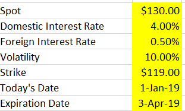
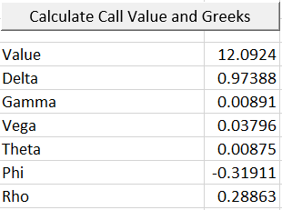
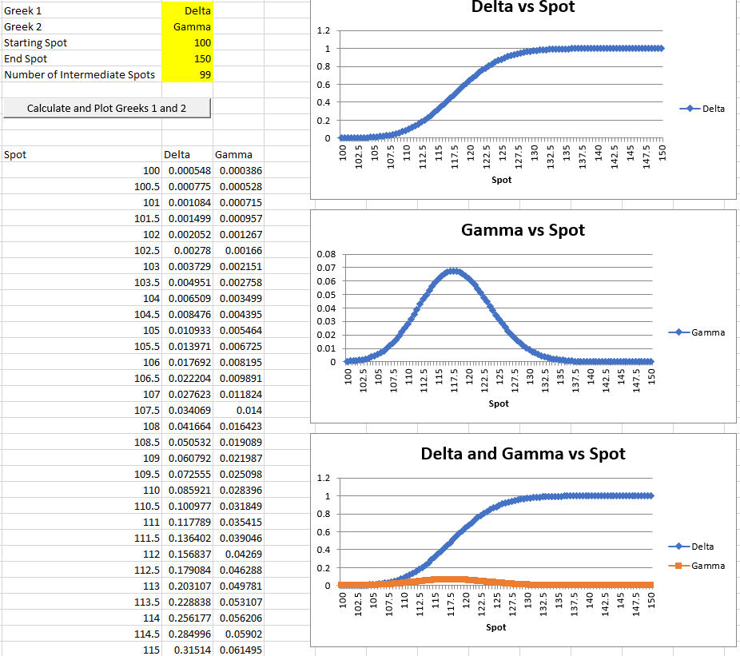
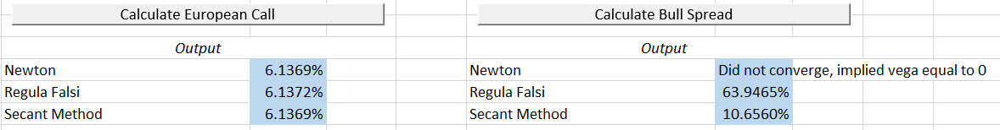
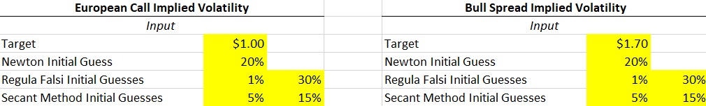
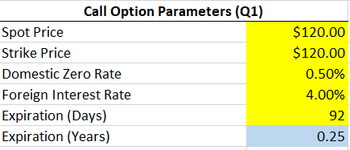
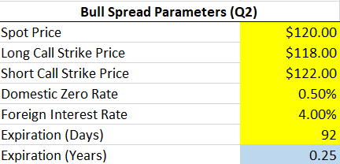

# Numerical Methods in Finance VBA Code and Corresponding Workbooks

A selection of VBA codes and macro-enabled Excel workbooks submitted as part of 
the Numerical Methods in Finance course offered by the Columbia Mathematics of 
Finance MA program.

## European Option Calculator

The VBA code and macro-enabled Excel workbook in this folder encapsulates the 
following functionality for European Options:

1. User inputs spot, domestic interest rate, foreign interest rate, volatility, 
strike, today’s date, and expiration date

    

2. The spreadsheet outputs: Value, Delta, Gamma, Vega, Theta, Phi (rate of 
change of value with respect to change of foreign interest rate), Rho (rate of 
change of value with respect to change of domestic interest rate) of the call 
option

    

3. The user can select two Greeks from the list of the Greeks above (Greek1 and 
Greek2), the starting spot, the end spot and the number of spots between the 
start and end value. Then, at the press of a button, the spreadsheet gives:
    (a) The spot-Greek1 graph
    (b) The spot-Greek2 graph
    (c) The Greek1-Greek2 graph
    
    

## Implied Volatility Calculator

The VBA code and macro-enabled Excel workbook in this folder implements implied
volatility functionality for European call options and bull spreads using the
following root solving methods on the Black Scholes formula:

1. Newton Raphson
2. Regula Falsi
3. Secant

    

With the following inputs:

1. Non-Product-Specific Inputs:
    (a) Target Market Value
    (b) Initial Guess(es) for each Root Solving Method
    
    

2. European Call Option Specific Inputs:
    (a) Spot Price
    (b) Strike Price
    (c) Domestic Zero Rate
    (d) Foreign Interest Rate
    (e) Expiration (In Days)
    
    

3. Bull Spreads Specific Inputs:
    (a) Spot Price
    (b) Long Call Strike Price
    (c) Short Call Strike Price
    (d) Domestic Zero Rate
    (e) Foreign Interest Rate
    (f) Expiration (In Days)
    
    
    